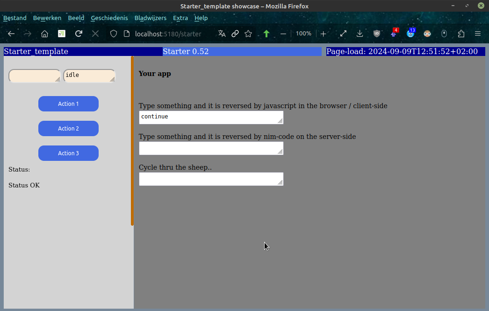

## json2mummy - re-implementation of json2web in mummy

This repo features the migration of some json2web-projects to mummy. It has been made because the jester-repo has become low-maintained, and also it is not clear if some will take up the project again. 

Currently the following repos have been migrated or newly created:
- hello_world; a minimal mummy-app
- controls_mummy; a project showcasing basic controls (has been siblingized) from the webserver.
- alacarte/superproject; showcasing how to create a collection-project (thru siblingization)
- scricon_mummy; controls with some basic scripting.
- datajson_mummy; showcasing a generic database-form.
- starter_mummy; a minimal project-template to start from

I will not re-enter all the tutorial-information from json2web, which will still sit in that repo:

<a href="https://github.com/some-avail/json2web" target="_blank">Go to the json2web-repo</a>

[Go to the Starter-template](#about-starter_mummy)

### What's new

- the starter-app 1.0 - create your app based on this template.
- updated datajson_mummy to 11.0; should fix the database-path problem

### Mummification of jester-projects

To mummify a jester-project take the follow steps:
- import the needed mummy modules (mummy, mummy/routers, mummy_utils) and remove jester
- move the route-parts to separate procs like 
	- getProject(request: Request)
	- postProject(request: Request)
- remove the routes-macro
- update the paths in project_outer.html (prefix "/public/") or your own html-file.
- add a cssHandler and the scriptHandler to enable the loading of respective files
- add the mummy-routes
- make sure no addons (like ublock) limit your view 

### About alacarte/superproject

This project is meant for a threefold goal:
- enable the usage of super-projects that can call other (sub)projects and form a navigation to these subprojects; however the projects are in sibling-orientation to each other.
- adjust a sub-project so that it can be called from another sibling-project (here: superproject)
- make sure the project can still be run independently.

To realize this approach you must do some adaptations to the subprojects' code:
- parentize paths; add prefixes like: ../subproject
  - for relevant imported project-modules
  - for scripts and css
- add: when isMainModule to the sub-project
- create constants for project and sibling-prefix
- publicize constants and procs with a * so that they can be called from elsewhere

After that you can simply copy the routes to the super-project.

### About scricon_mummy

Warning:
The cookie-tunnel-code is deprecated, because one can easily run server-code thru
the curaction variable . This is a textarea-element that can be set from javascript,
and can be read on the server after a form-submit to execute the needed server-code.

See starter or datajson for this newer approach.

### About Datajson_mummy

In case of tab-duplication use a tabID (like in datajson_mummy) and set persistence to persistOnDisk because in mummy you must compile for with multi-threading. The futural approach is probably persistInBrowserSessionStorage or something like that.

### <a name="about-starter_mummy">About starter_mummy</a>

Starter_mummy that can be used /copied as template with not much content but with the needed boiler-plate code to start a project. Extra info can be found on top of the starter_startup.nim-file. 

Download the code and compile with :
nim c -r --mm:orc --threads:on starter_startup.nim 

Run with:

[http://localhost:5180/starter](http://localhost:5180/starter)

If it works recopy the starter-project and adjust the project-prefix "starter" to your own project and update the name on all relevant locations in the code.

This project must be kept up to date. 

### Still to be done

- implement a form of persistInBrowser

